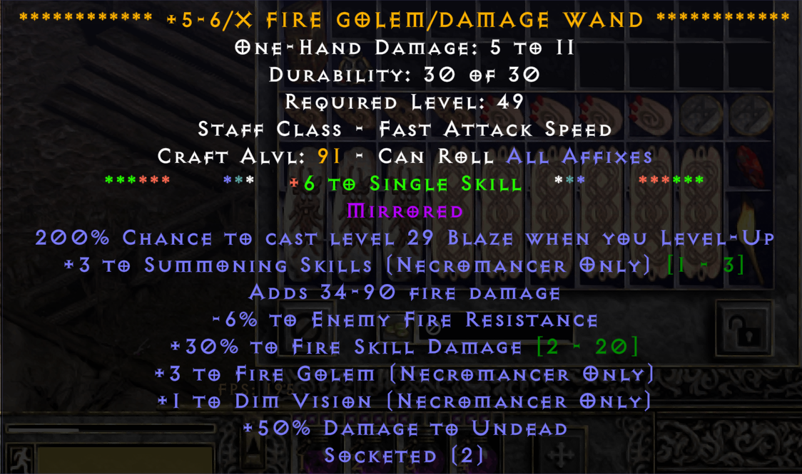

# Roofoo’s PD2 Loot Filter

**Edited and maintained by:**  
- [Enpherno](https://twitch.tv/Enpherno)  
- [RoofooEvazan](https://twitch.tv/RoofooEvazan)

A selectively customized fork of **[Kryszard](https://twitch.tv/Kryszard)’s Project Diablo 2 loot filter**.

This filter preserves Kryszard’s original structure and philosophy while adding **targeted late-game refinements**, stricter **FL7+/FL8+ filtering**, reduced ground clutter, and clearer base and quality visibility for end-game farming and mapping.

All changes are incremental and intentional, designed to enhance high-level play without sacrificing the clarity, information density, or reliability of the original filter.

👉 **Full credit to Kryszard** for the base loot filter.

---

## 🔄 Changelog
Current Version - 12.1.5 - Updated December 29, 2025

The sections below document notable changes compared to the base Kryszard filter.

---

### 🟨 ITEMS – UNIQUE
12.1.1
- Added meme highlight to **unid Unique Bastard Swords**
- **Uldyssian’s Awakening** downgraded to ★☆☆ (Eth remains ★★★)
- **Whispering Mirage** downgraded to ★☆☆
- **Fleshripper** downgraded to ☆☆☆
- **Ripsaw** downgraded to ☆☆☆
- **Achilles’ Edge** downgraded to ☆☆☆ (Eth remains ★★★)
- **Hellrack** downgraded to ☆☆☆
- **Wraithflight** downgraded to ☆☆☆ (Eth also ☆☆☆)
- **Ribcracker** downgraded to ☆☆☆ (Eth remains ★★★)
- **Steel Carapace** upgraded to ★★★ (Eth pickup enforced)
- **Wolfhowl** downgraded to ☆☆☆
- **Steel Shade** downgraded to ★☆☆
- **Hotspur** downgraded to ★☆☆
- **Homunculus** downgraded to ★☆☆
- **Gerke’s Sanctuary** downgraded to ★☆☆
- **The Oculus** downgraded to ★☆☆
- **Death Cleaver** downgraded to ★☆☆ (Eth remains ★★★)
- **Wraithskin** downgraded to ☆☆☆
- **Sacred Totem** downgraded to ☆☆☆
- **Zerae’s Resolve** downgraded to ☆☆☆
- **Shatterblade** downgraded to ☆☆☆
- **Stalker’s Cull** downgraded to ☆☆☆
- **Ebonbane** downgraded to ☆☆☆
- **Crackleshot** downgraded to ☆☆☆
- **Titan’s Grip** downgraded to ★☆☆
- **Arkaine’s Valor** upgraded to ★★★ pickup
- **Snowclash** upgraded to ★★★ pickup
- **Shifter / Cranium Basher** downgraded to ★☆☆ (Eth remains ★★★)
- **Magefist** upgraded to ★☆☆
- **Marrowwalk** upgraded to ★☆☆
- **Cranebeak** upgraded to ★★★
- **Skull Collector** upgraded to ★☆☆
- **Corpsemourn** upgraded to ★☆☆
- **Harlequin Crest (Shako)** downgraded to ★★★
- **Widowmaker** upgraded to ★☆☆
- **Blackhand Key** upgraded to ★☆☆
- **Pus Spitter** upgraded to ★★★
- **Razor’s Edge** downgraded to ☆☆☆
- **Guardian Angel** downgraded to ★☆☆
- **Twilight’s Reflection** downgraded to ★☆☆
- **Goblin Toe** downgraded to ☆☆☆
- **Silks of the Victor** upgraded to ★☆☆
- **Plague Bearer** upgraded to ★☆☆
- **Brimstone Rain** downgraded to ★★★

12.1.2
- **Executioner's Justice** upgraded to ★☆☆
- **Jade Talon** upgraded to ★☆☆
- **Steel Pillar** downgraded to ★☆☆ (Eth remains ★★★)
- **Widowmaker** upgraded to ★☆☆
- **Purgatory** downgraded to ★☆☆ (Eth remains ★★★)
- **Messerschmidt's Reaver** downgraded to ★☆☆ (Eth remains ★★★)
- **Arreat's Face** downgraded to ★☆☆
- **Gargoyle's Bite** downgraded to ★☆☆
- Fixed an issue which was causing eth unique spears and polearms to hide but make the drop sound

12.1.3
- **Stoneraven** upgraded to ★☆☆ (Eth upgraded to ★★★)

12.1.4
- **Skin of the Vipermagi** downgraded to ★☆☆
- **Grims Burning Dead** upgraded to ★☆☆
- **Elite Unique Arrows** downgraded to ★☆☆
- **Demon Machine** upgraded to ★☆☆

12.1.5
- **Hellmouth** upgraded to ★☆☆
- **Leviathan** downgraded to ★☆☆

---

### 🟩 ITEMS – SET
12.1.1
- **Laying of Hands** upgraded to ★☆☆
- **Trang-Oul’s Armor** upgraded to ★☆☆
- **Trang-Oul’s Shield** upgraded to ★☆☆
- **Trang-Oul’s Gloves** upgraded to ★☆☆
- **Natalya’s Mark** downgraded to ★☆☆

12.1.2
- **Tal Rasha's Guardianship (Armor)** downgraded to ★☆☆

12.1.4
- **Aldur's Stony Gaze (Helm)** upgraded to ★☆☆
- **Griswold's Heart (Chest)** upgraded to ★☆☆
- **Trang-Oul's Girth (Belt)** upgraded to ★☆☆

12.1.5
- **Immortal King's Soul Cage (Armor)** downgraded to ★☆☆

---

### 🟦 ITEMS – RARE
12.1.1
- **Rare Necromancer Heads** upgraded to ★☆☆

---

### 🛒 SHOP
12.1.1
- Added bold highlights to:
  - **+6 Fire Golem Wands**
  - **+5–6 Fire Golem & Fire Skill Damage (>1%) Wands**

---

### 🧿 CHARMS
12.1.1
- Charms now display as **teal text**
- **Filter Level 8** hides all charms **below iLvl 90**
- **iLvl 90 charms** gain additional blue dot indicators
- Minimap icons suppressed when < iLvl 90 charms are hidden

---

### 💎 JEWELS
12.1.1
- Jewels now display as **teal text**
- **≥ iLvl 85 jewels** gain additional dots:
  - Blue for magic
  - Yellow for rare

---

### 🔷 GEMS
12.1.1
- **Flawless Skulls** always shown on all filter levels

---

### 🔊 SOUNDS
12.1.1
- Replaced various drop sounds with **Path of Exile–style sounds**
- Removed drop sounds from **1-star items**
- ⚠️ Known issue: some sounds may skip due to priority conflicts

12.1.2
- High Rune drop sounds changed to POE sounds to ensure priority over other sounds (results of existing LOD sounds having too low priority)

12.1.3
- Changed HR drop sounds back to Kryszard OG now that prioritization is corrected with the recent patch
- Changed 3-Star and 3-Star [ETH] to new sound

---

### 🔑 UBER KEYS
12.1.1
- Notification color changed to **orange**

---

### 🎚 FILTER LEVEL 6 & 7
**Armor**
12.1.1
- Hide all magic helms (including eth; excluding circlets)
- Hide all magic armors (including eth)
- Hide all magic shields (including eth)

**Weapons**
12.1.1
- Hide all magic spears & polearms (including eth; excluding Pike / Lance / War Pike)
- Hide all magic Amazon spears (including eth)

**Class Bases**
12.1.1
- Hide all ethereal Druid pelts

---

### 🎚 FILTER LEVEL 7 & 8
12.1.1
- Hide all rare gloves
- Hide all rare bolts

---

### 🎚 FILTER LEVEL 8 (STRICT)
**Armor**
12.1.1
- Hide all magic & rare non-class shields (including eth)
- Hide all magic boots, gloves, and belts (including eth)

12.1.2
- Hide all normal and exceptional armor bases excluding Gothic Plate and Linked Mail (including eth) **To be assessed further, may adjust in future versions**
- Hide all non-magic and superior elite armor bases with less than 10% enhanced defense (including eth)
  
12.1.5
- Enforced FL8 hide rules for elite armor bases consistently outside of town, ensuring sub-10% enhanced defense bases no longer bypass strict filtering
- Prevented generic armor formatting passes from re-exposing armor bases intended to be hidden at FL8
- Normalized FL8 armor behavior to apply only outside of town, matching intended strictness design

**Weapons**
12.1.1
- Hide all non-magic, non-superior non-staff weapons
- Hide all non-magic, non-superior non-class bases
- Hide non-magic Phase Blades
- Hide non-magic dagger bases
- Hide magic daggers and javelins (including eth)
- Hide non-magic, no-skill Archon staves
- Hide rare and magic daggers (including eth)
- Hide all rare and magic scepters (including eth)

12.1.2
- Hide all rare and magic maces (including eth)
- Hide all rare and magic Legend Sword/Espandon/Two-handed Sword (including eth)
- Hide all non-magic and superior spear and polearms with less than 10% enhanced damage (including eth)
  
12.1.3
- Fixed an issue that was causing all phase blades to show
- Hide all 5os Crystal swords in town but hide outside of town
- Hide all non-magic non-skill Archon staves

12.1.5
- Enforced strict FL8 hide behavior for all one-handed sword bases outside of town unless explicitly whitelisted
(includes Crystal Sword, Broad Sword, Long Sword, War Sword, Rune Sword, Battle Sword, and all exceptional/elite equivalents)
- Phase Blade handling is under active refinement
- Groundwork has been implemented to restrict Phase Blades to display only when meeting explicit enhanced damage and socket criteria
- Current status: Phase Blade visibility on FL8 may still be inconsistent in certain cases and is not yet considered final
- Prevented generic WEAPON / 1H rules from unintentionally allowing non-approved sword bases to appear on FL8
- Corrected FL8 evaluation order to ensure non-magic and superior weapon bases are fully hidden unless explicitly allowed
- Closed edge cases where valid hide rules were previously bypassed due to rule ordering or %CONTINUE% behavior
Note: Several of these weapon bases were implicitly visible prior to 12.1.5 due to broader weapon rules matching earlier than FL8 hides.
This version makes those hides deterministic. Phase Blade logic remains a known work in progress.
  
**Class Bases**
12.1.2
- Hide all non-magic & magic Barbarian helms (including eth)
- Hide magic & rare Sorceress orbs (including eth),  
  excluding Jared Stone, Swirling Crystal, Dimensional Shard
- Hide magic & rare Paladin shields (including eth)
- Hide non-magic & superior Paladin shields,  
  excluding Vortex, Kurast, and Zakarum Shields
- Hide all non-magic, socketed or skills druid pelts

12.1.3
- Fixed an issue the was causing barb and druid helms to show

12.1.5
- Fully enforced FL8 hide rules for Barbarian helms and Druid pelts, ensuring no fallback visibility through generic armor or class-base rules
- Corrected class-base evaluation order so non-magic and superior class items are no longer re-shown by later formatting rules
- Ensured Paladin shield restrictions apply consistently outside of town with no leakage from non-class shield logic

## 📸 Screenshot Examples

### Charm & Jewel Examples

### Meme Enpherno Bastard Sword Drop Example

### Notification Example

### Fire Golem Shop Highlight Example

