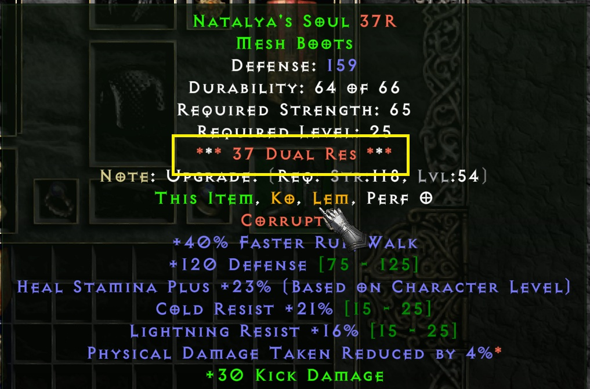
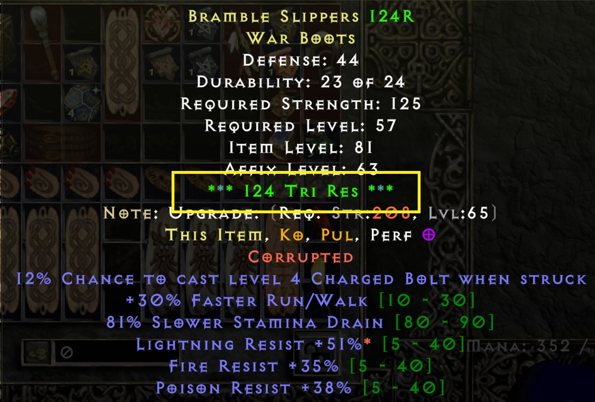
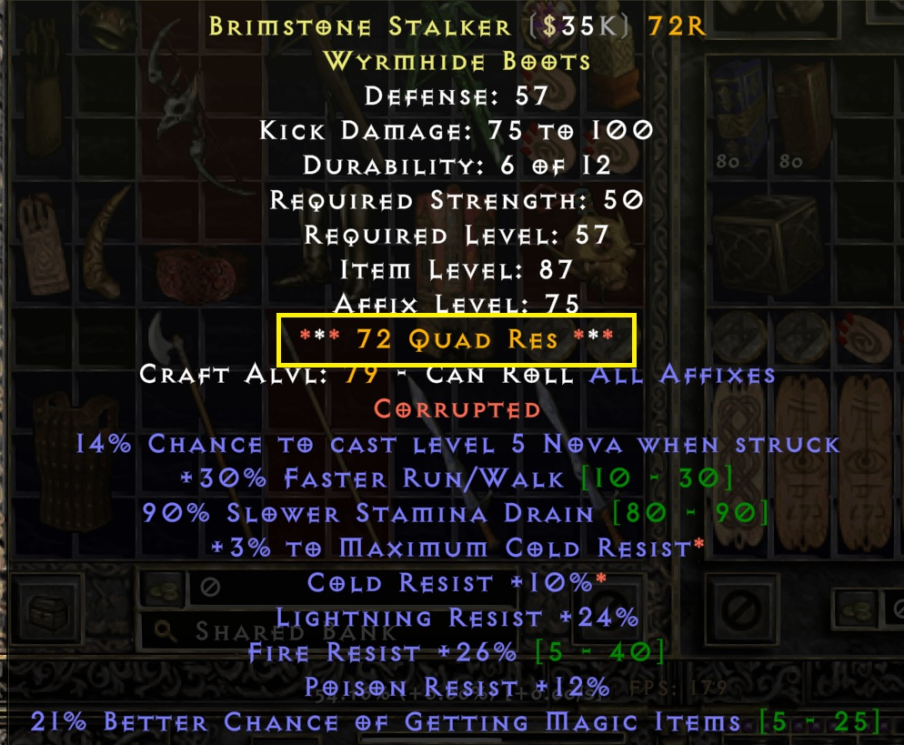
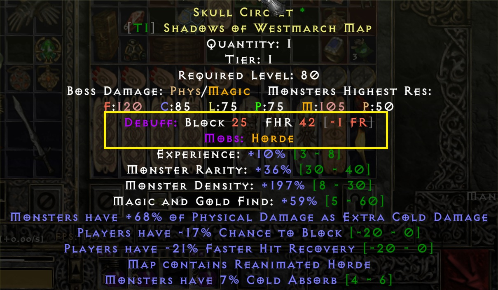
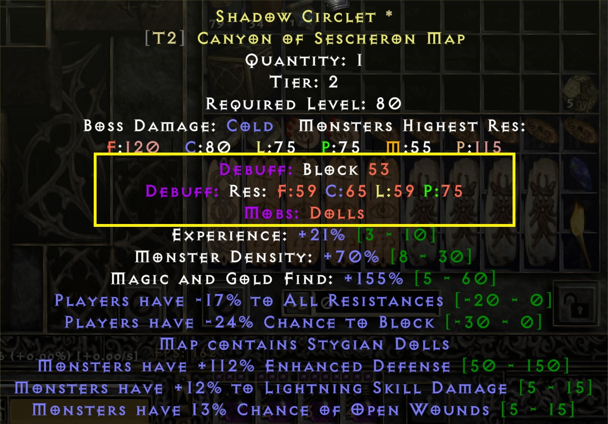
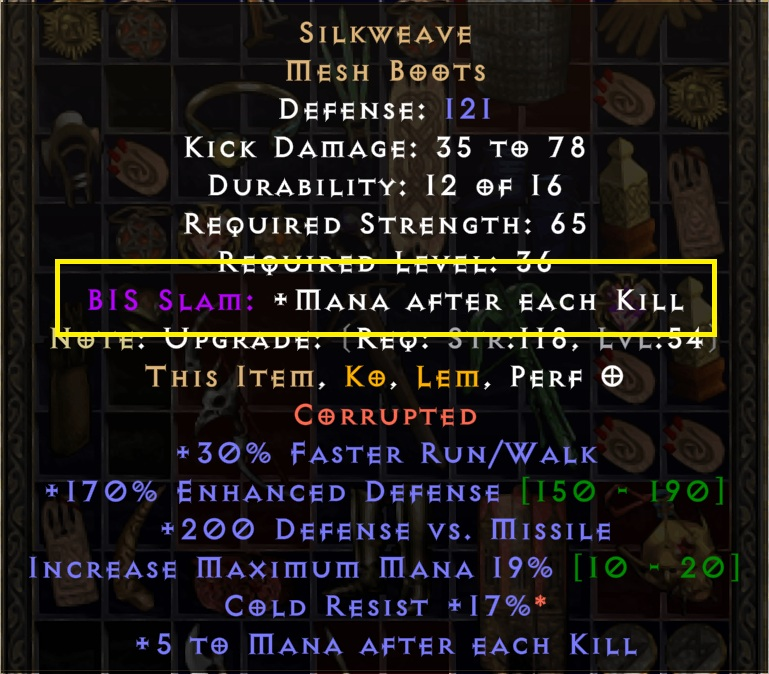
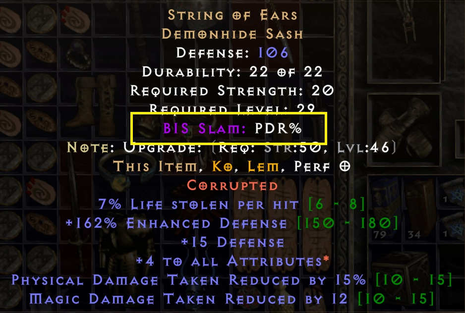
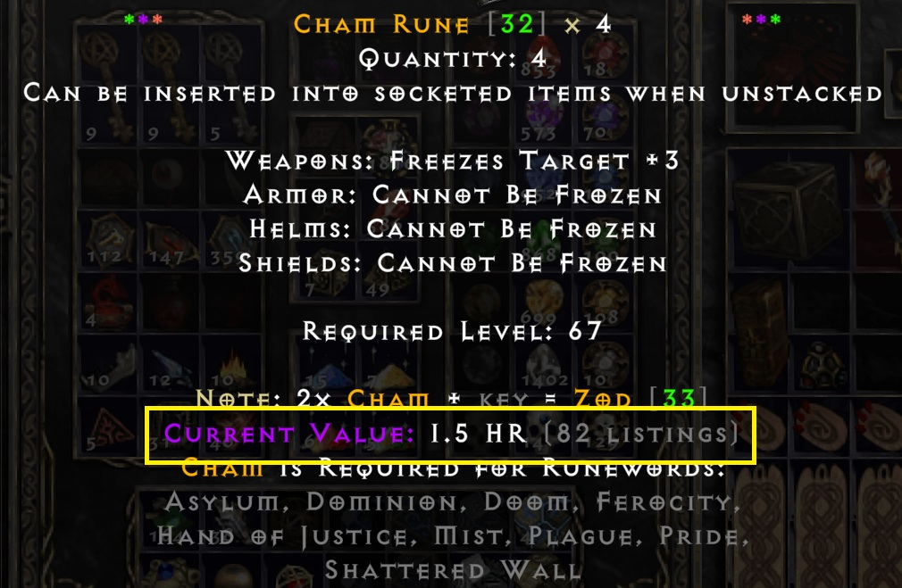
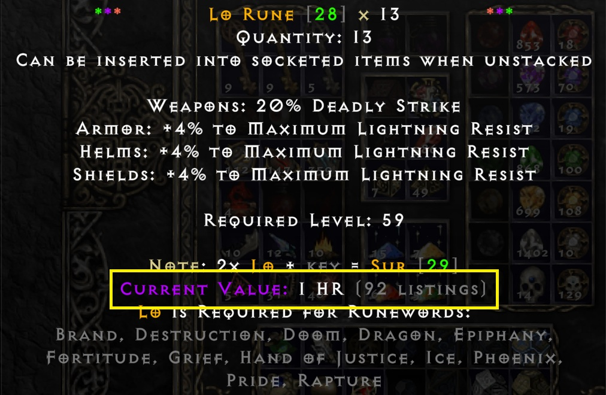
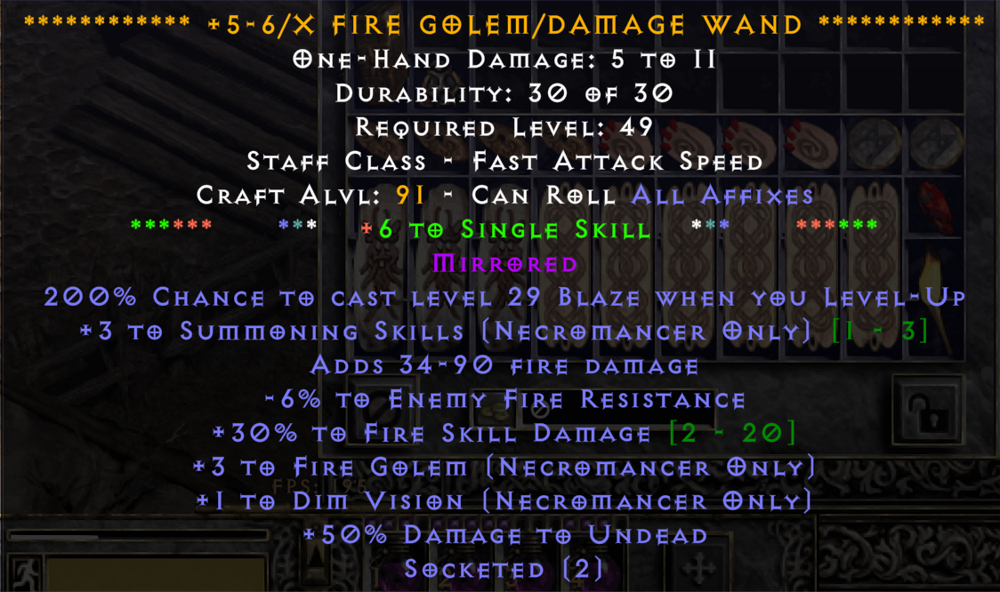

# Roofoo’s PD2 Loot Filter

**Edited and maintained by:**  
- [Enpherno](https://twitch.tv/Enpherno)  
- [RoofooEvazan](https://twitch.tv/RoofooEvazan)

A selectively customized fork of **[Kryszard](https://twitch.tv/Kryszard)’s Project Diablo 2 loot filter**.

This filter preserves Kryszard’s original structure and philosophy while adding **targeted late-game refinements**, stricter **FL7+/FL8+ filtering**, reduced ground clutter, and clearer base and quality visibility for end-game farming and mapping.

All changes are incremental and intentional, designed to enhance high-level play without sacrificing the clarity, information density, or reliability of the original filter.

👉 **Full credit to Kryszard** for the base loot filter.

---

## 🔄 Changelog
**Current Version:** 13.0.2  
**Updated:** April 30th, 2026  

---

## 💡 What This Filter Is About

- Clean, readable loot presentation  
- Smart highlighting for actually valuable items  
- Strict endgame filtering (FL8) without losing safety in town  
- Helpful stat summaries so you don’t need to ID everything blindly  
- Built for real gameplay, not just theorycrafting  

---

## ⭐ ITEMS – UNIQUE & SET

### Simplified Tiering System

All Unique and Set items are now grouped into easy-to-understand tiers:

- ⭐ No Star (low priority)  
- ⭐⭐ 1-Star (situational / niche)  
- ⭐⭐⭐ 3-Star (good items)  
- ⭐⭐⭐📦 3-Star Pickup (always worth grabbing)  

All items and tiers can be easily viewed at https://docs.google.com/spreadsheets/d/1AS-dQqCeaY0zxShYd6qVlFXGqRtlsRKtRBPwFgL5Sws/edit?usp=sharing

### What Changed

- Cleaned up and unified all tier logic  
- Removed old LoD vs PD2 split  
- Updated tiers to match current endgame expectations  

### FL8 Behavior (Strict Mode)

- ❌ Unlisted unidentified Uniques/Sets are hidden outside town  
- ✅ Still visible in town (so you never lose items permanently)  
- ✅ Special items (like unique maps & Uber drops) are always handled safely  

### Special Touches

- Enpherno Bastard Sword meme highlight lives on  
- Uber/DClone drops handled with map-specific logic  

---

## 👢 BOOTS (RARE / CRAFTED / SET / UNIQUE)

This is one of the biggest QoL upgrades.

### 🔥 Resistance Summary System

- Total resistances now show directly on the ground item name  

### 🧠 Smart Labels

- Dual Res  
- Tri Res  
- Quad Res  

### 🎨 Color Scaling

- 🔴 Low (<70) → Red  
- 🟠 Medium (70–90) → Orange  
- 🟢 High (90+) → Green  

### Examples

#### Dual Res Example

#### Tri Res Example

#### Quad Res Example

---

## 🟡 RARES & 🟠 CRAFTED ITEMS

- Same resistance system as boots applied where relevant  
- Cleaned-up tooltip info  
- Easier to evaluate value vs junk  

---

## 🗺️ MAPS – HUGE UPGRADE

Maps now actually tell you what matters before you enter.

### ⚔️ Debuff Intelligence

- **Block reduction** → Shows your actual block chance after map debuffs  
- **FHR reduction** → Shows real FHR + frame loss if applicable  
- **All res reduction** → Shows character resistances after the map debuff is applied
  
👉 These only display when rolled on the map  

---

### 👹 Monster Roll Alerts

Quick tags show dangerous or notable spawns:

- MoD (Minions of Destruction)  
- Dolls 💀  
- Souls ⚡  
- Cows 🐄  
- Ghosts  
- Witches  
- Fetishes  
- Vampire Lords  
- Reanimated Horde  
- Extra Boss rolls  

---

### 🛡️ Resistance Display Upgrade

- Shows highest monster resistance values  
- 100+ still highlights immunity  

#### Map Debuff & Mob Smart Labeling

---

### ⚔️ Dynamic Best In Slot Slams - BETA FEATURE FOR NOW

- Added dynamic BIS slams to each weapon which are updated every 6 hours based on the last 48 hours of listings

---

### ⚔️ Dynamic Rune Prices - BETA FEATURE FOR NOW

- Added dynamic rune prices to each stackable rune which are updated every 6 hours based on the last 48 hours of listings

---

## 🔊 SOUND SYSTEM

- ❌ No Star / 1-Star → No sound  
- ⭐⭐⭐ → Notification sound  
- ⭐⭐⭐📦 → Strong alert  

👉 Less noise, more signal  

---

## 🚫 FILTER LEVEL 8 (STRICT MODE)

### Behavior

- Aggressively hides low-value clutter  
- Hides unlisted Uniques/Sets outside town only  
- Keeps everything visible in town  

👉 Maximum efficiency without risk  

---

## 🧹 QUALITY OF LIFE

### 💰 Sell Value Cleanup

- Displays as `$35K` instead of long numbers  

### 🧼 General Improvements

- Cleaner internal structure  
- Easier future updates  

Removed:

- DPS display experiments  
- Ground-name spacing tests  
- Formatting leftovers  

---

## 🎯 WHO THIS FILTER IS FOR

- Players pushing maps and endgame content  
- Anyone tired of loot clutter  
- Players who want smart info at a glance  
- Players who enjoy clean visuals + useful data  

---

## 🚀 FINAL NOTE

This filter is built from real gameplay experience—not just theory.

It evolves every season to stay aligned with:

- PD2 balance changes  
- Meta shifts  
- What actually matters in real gameplay  

---

## 📸 Screenshot Examples

### Charm & Jewel Examples

### Meme Enpherno Bastard Sword Drop Example

### Notification Example

### Fire Golem Shop Highlight Example

