# Roofoo’s PD2 Loot Filter

A customized fork of **[Kryszard](https://twitch.tv/Kryszard)’s Project Diablo 2 loot filter**, tuned for late-game farming and mapping: stricter FL7+/FL8+ filtering, less ground clutter, and clearer bases, qualities and item info. It keeps Kryszard’s structure and philosophy. 👉 **Full credit to Kryszard** for the base filter.

**Maintained by** [RoofooEvazan](https://twitch.tv/RoofooEvazan) and [Enpherno](https://twitch.tv/Enpherno)

**Current version:** 13.0.8 (May 15, 2026)

🎨 [Filter Builder](https://roofooevazan.github.io/Roofoo-s-PD2-Loot-Filter/) · ⭐ [Tier list spreadsheet](https://docs.google.com/spreadsheets/d/1AS-dQqCeaY0zxShYd6qVlFXGqRtlsRKtRBPwFgL5Sws/edit?usp=sharing) · 🐞 [Report a problem](https://github.com/RoofooEvazan/Roofoo-s-PD2-Loot-Filter/issues)

---

## Contents

- [Getting the filter](#-getting-the-filter)
- [Filter levels](#-filter-levels)
- [Make it yours: Filter Builder](#-make-it-yours-filter-builder)
- [Unique & set tiers](#-unique--set-tiers)
- [Mystery drops](#-mystery-drops)
- [Resistance summaries](#-resistance-summaries)
- [Maps](#%EF%B8%8F-maps)
- [Live market prices](#-live-market-prices)
- [Item info & quality of life](#-item-info--quality-of-life)
- [Screenshots](#-screenshots)

---

## 📥 Getting the filter

**From the PD2 launcher (recommended).** Open the loot filter settings, pick **Roofoo's Filter** from the online list, then choose one of the files below. This version updates on its own and includes the live market prices.

| File | What it is |
| --- | --- |
| `Roofoo.filter` | The main filter. |
| `RoofooMystery.filter` | The main filter plus [Mystery drops](#-mystery-drops): big drops hide their name outside town. |
| `RoofooSlamfestBETA.filter` | Beta. The main filter plus a town "slamfest" mode on FL9 that shows the best corruptions and their prices for identified uniques and sets. |

**Your own version.** Use the [Filter Builder](#-make-it-yours-filter-builder) to change colors, sounds, tiers and what shows on each level, then put the downloaded file in `Diablo II\ProjectD2\filters\local\` and pick it under **Local** in the launcher.

---

## 🎚️ Filter levels

Pick the level in game. The Horadric Cube's tooltip shows which one is active.

| Level | Name |
| --- | --- |
| FL0 | Show All Items |
| FL1 | Hide Just Trash Items |
| FL2 | More Notify |
| FL3 | More Notify - w/o Potions |
| FL4 | Recommended |
| FL5 | Recommended - w/o Potions |
| FL6 | Strict Filter |
| FL7 | Strict Filter - w/o Potions |
| FL8 | Max-Strictness Filter - Ultra Strict End Game |
| FL9 | Max-Strictness Filter - No Large Charms |

**FL8 and FL9 (strict mode)** aggressively hide low-value clutter, but only outside town. In town, in shops, in your inventory, cube and stash everything stays visible, so you never lose an item.

- Uniques, sets and runewords always pass the strict checks. Unidentified uniques and sets that aren't in a [star tier](#-unique--set-tiers) are hidden outside town. Unique maps and uber drops are always handled.
- White bases, magic and rare gear only show when they're worth a look: selected bases with good sockets or enhanced defense/damage, and selected magic/rare bases (e.g. barbarian helms, war/rune/archon staves).
- Set amulets are hidden.

**FL9** is FL8 plus it also hides magic Large Charms, set rings and antidote potions outside town.

---

## 🎨 Make it yours: Filter Builder

**[Open the Filter Builder](https://roofooevazan.github.io/Roofoo-s-PD2-Loot-Filter/)**: no filter code needed.

- **Colors & sounds:** pick a color theme (Classic, Ember, Frost, Venom, Royal, High Contrast) or restyle any single highlight, and choose drop sounds with previews in your browser.
- **Items:** every unique, set, rare, magic, base, rune, gem and potion in collapsible sections. Change star tiers, turn Mystery drops on or off, and show or hide anything per filter level, narrowed by ethereal, sockets, superior, item level or character level.
- **Test an item** and **Overview & review:** see how any item looks on every filter level, or everything your filter shows and hides, with in-game style item cards on hover.
- **Save & install:** download your `.filter`, share your setup as a link, or load it back later.

The builder always starts from the newest version of this filter, so come back after an update and download again. Your choices are saved in your browser.

Custom versions leave out the [live market prices](#-live-market-prices), which only stay current in the launcher version, and always show items newer than the filter, marked `[Missing]`.

[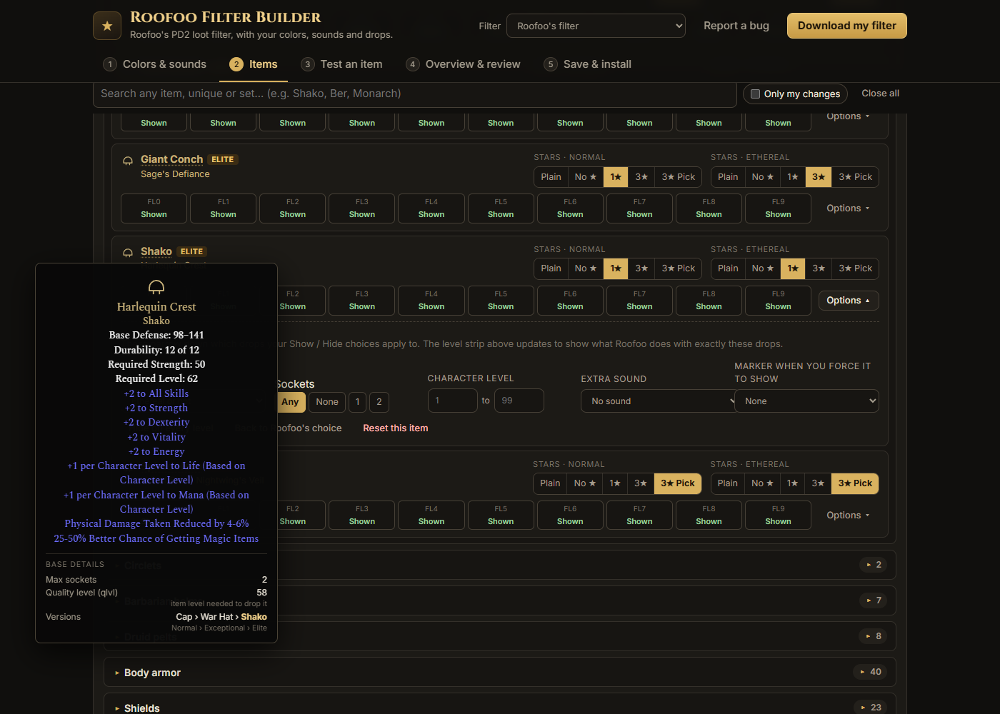](screenshots/BuilderItems.png)

---

## ⭐ Unique & set tiers

Every unique and set item is sorted into a tier by its base item. The tier decides its look, minimap marker and sound. The full list is in the [tier list spreadsheet](https://docs.google.com/spreadsheets/d/1AS-dQqCeaY0zxShYd6qVlFXGqRtlsRKtRBPwFgL5Sws/edit?usp=sharing).

| Tier | Meaning | Look | Sound |
| --- | --- | --- | --- |
| No star | Low priority | Small minimap marker | None |
| 1 star | Situational / niche | Stars and a minimap marker | None |
| 3 star | Good items | Decorated name and minimap marker | Notification |
| 3 star pickup | Always worth grabbing | Big border, "pick … up" label | Strong alert |

Less noise, more signal: only 3-star items and up make a sound.

**Special drops**

- **HOLY MOLY:** uber boss uniques (e.g. The Third Eye, Cage of the Unsullied, Band of Skulls, Overlord's Helm) get their own label and sound.
- Uber and DClone materials are handled with map-specific logic.
- Enpherno's Bastard Sword meme highlight lives on.

---

## 🩸 Mystery drops

In `RoofooMystery.filter`, selected high-value drops hide their real name while they're unidentified outside town. You see a mystery label and hear a custom sound instead, and find out what it is back in town.

| Label | Applies to | Drops |
| --- | --- | --- |
| Little Bastard | Lower mystery drops | Vex, Ohm and Lo runes, Larzuk's Puzzlebox, Skeleton Key, Demonic Cube |
| Lucky Bastard | Higher mystery drops | Sur, Ber, Jah, Cham and Zod runes, Vial of Lightsong, Lilith's Mirror, Horadrim Navigator, Horadrim Almanac, Tyrael's Might / Templar's Might |
| Big Bastard | 3-star uniques | Mang Song's Lesson, Griffon's Eye, Veil of Steel / Nightwing's Veil |
| Big Bastard | Ethereal 3-star uniques | Mang Song's Lesson, Doombringer, Executioner's Justice, The Grandfather, The Cranium Basher / Earth Shifter, Steel Pillar, Tomb Reaver, The Reaper's Toll, Stormspire, Schaefer's Hammer / Stone Crusher, Bloodtree Stump, Tyrael's Might / Templar's Might, Veil of Steel / Nightwing's Veil, Purgatory, Steel Carapace |
| HOLY MOLY | Uber boss uniques, only inside the boss arenas | The Third Eye, Cage of the Unsullied, Band of Skulls, Aidan's Scar, Dark Abyss, Itherael's Path, Overlord's Helm, Hadriel's Hand |

- Mystery labels only show outside town. Returning to town reveals the item's name.
- Every mystery label has its own sound.
- With the Filter Builder you can change which drops are mysteries and how each label looks and sounds.

[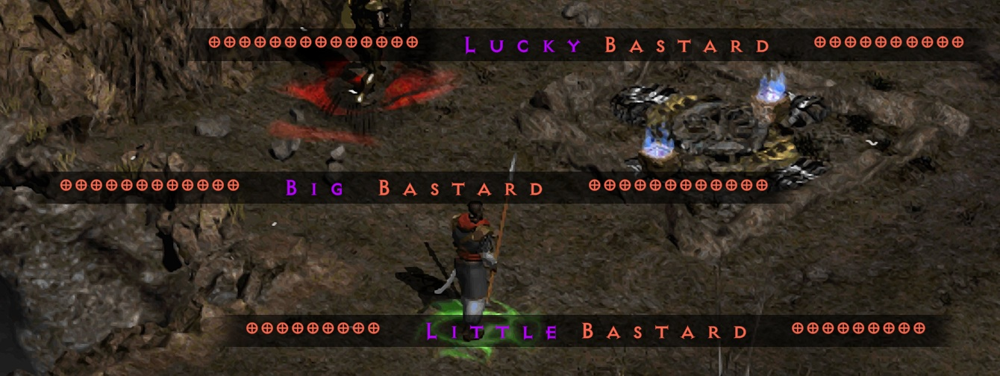](screenshots/MysteryExample2.jpg)

---

## 👢 Resistance summaries

Boots (rare, crafted, set and unique), and rare and crafted gear where it matters, show their **total resistances right on the ground label**, with a smart label and a color:

- **Dual Res**, **Tri Res** or **Quad Res**
- 🔴 Low (under 70) · 🟠 Medium (70–90) · 🟢 High (90+)

| Dual res | Tri res | Quad res |
| --- | --- | --- |
| [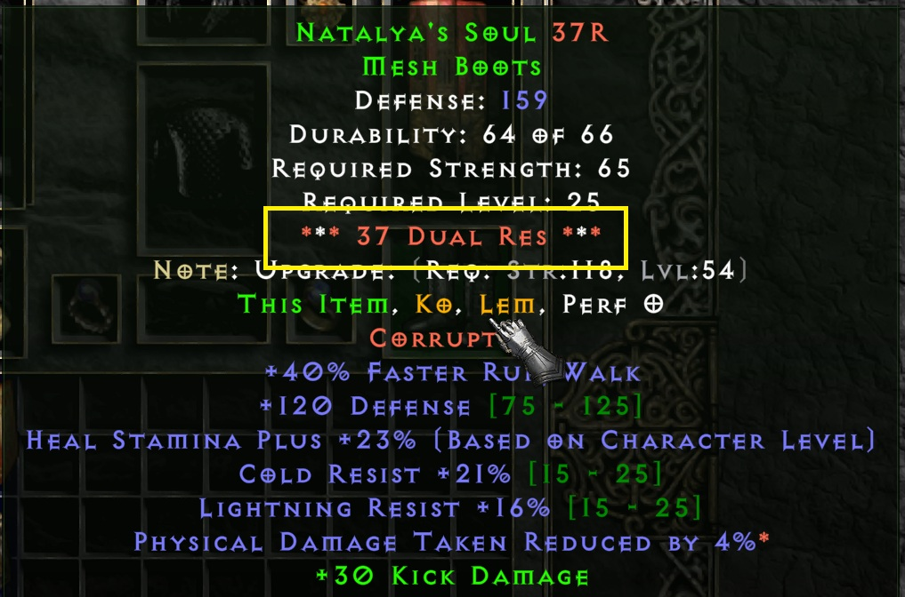](screenshots/BootDualResExample.jpg) | [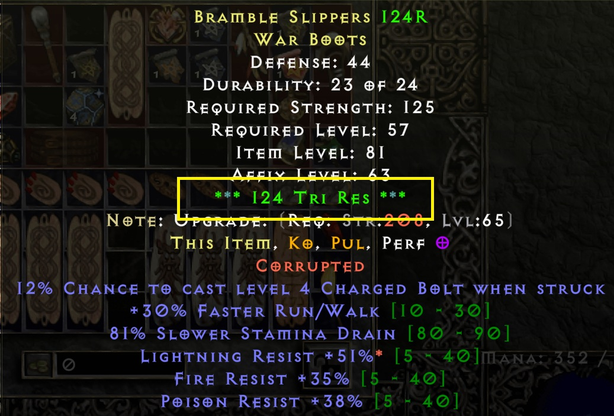](screenshots/BootTriResExample.jpg) | [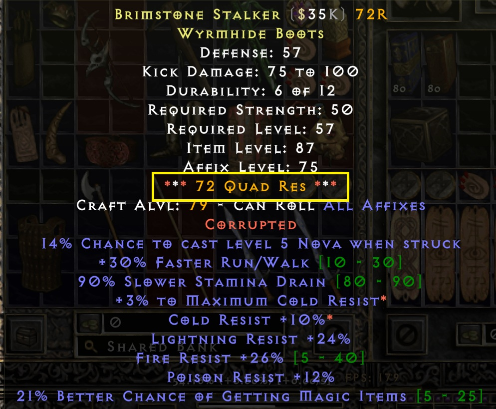](screenshots/BootQuadResExample.jpg) |

---

## 🗺️ Maps

Maps tell you what matters before you enter.

**Debuffs, worked out for you** (only shown when the map rolled them):

- **Block reduction:** your real block chance after the debuff.
- **FHR reduction:** your real FHR, and frame loss if any.
- **All resistance reduction:** your resistances after the debuff.

**Monster alerts:** quick tags for dangerous or notable spawns: Minions of Destruction, Dolls 💀, Souls ⚡, Cows 🐄, Ghosts, Witches, Fetishes, Vampire Lords, Reanimated Horde and extra boss rolls.

**Monster resistances:** the highest monster resistance values, with 100+ still highlighted as immune.

[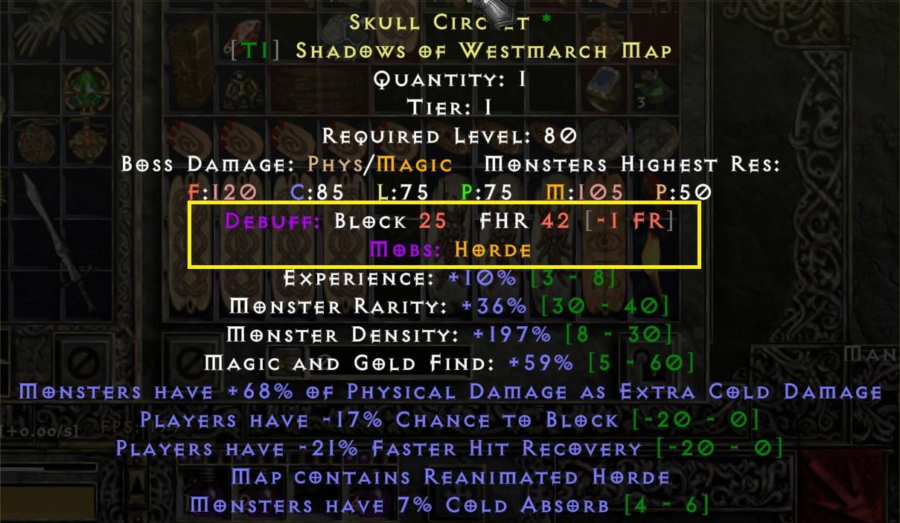](screenshots/MapSmartFilterExample.jpg)
[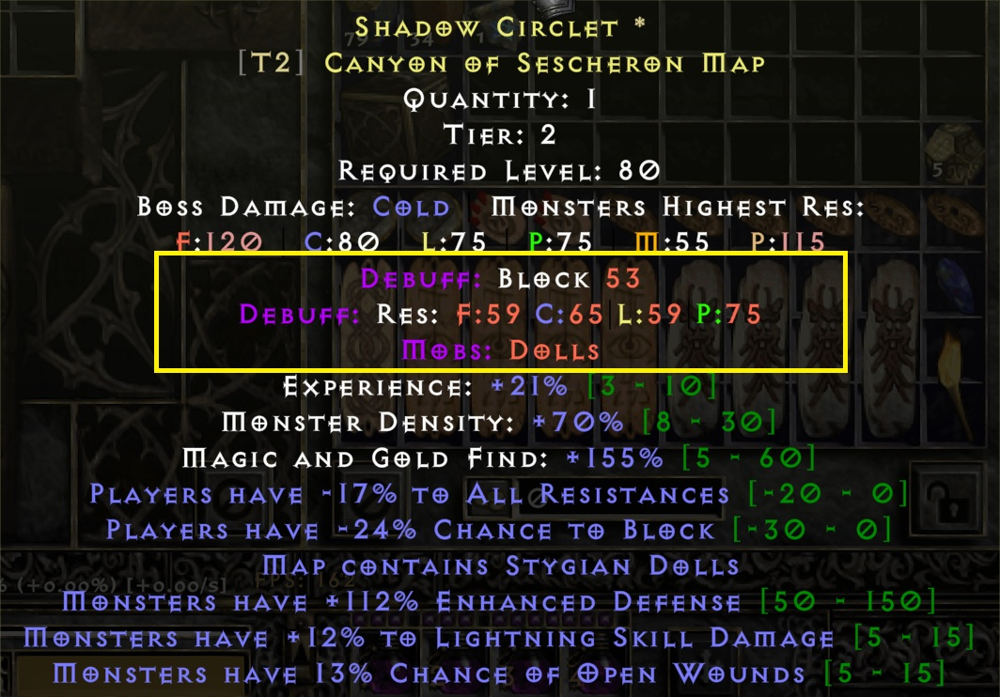](screenshots/MapSmartFilterExample2.jpg)

---

## 💹 Live market prices

*Beta.* Market values from PD2's own market listings and [PD2 Trader](https://pd2trader.com), refreshed in this repository every 6 hours:

- **Rune prices:** median values over the last 24 hours, 48 hours, 72 hours and 1 week on rune stacks, with the current high-rune values on the Horadric Cube.
- **Best-in-slot slams:** on FL8, identified uniques and sets show their most valuable corruption and its price range, based on the last 48 hours of listings.
- **Rainbow Facet values** by type and roll, plus key and boss material values.

These only work in the **launcher version**, which gets the updates automatically. Custom versions made with the Filter Builder leave them out instead of letting them go stale.

| BIS slams | Rune prices |
| --- | --- |
| [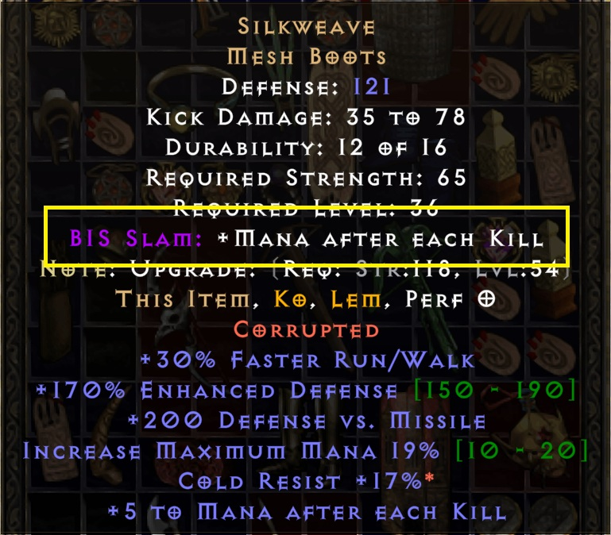](screenshots/BISSlamExample.jpg) | [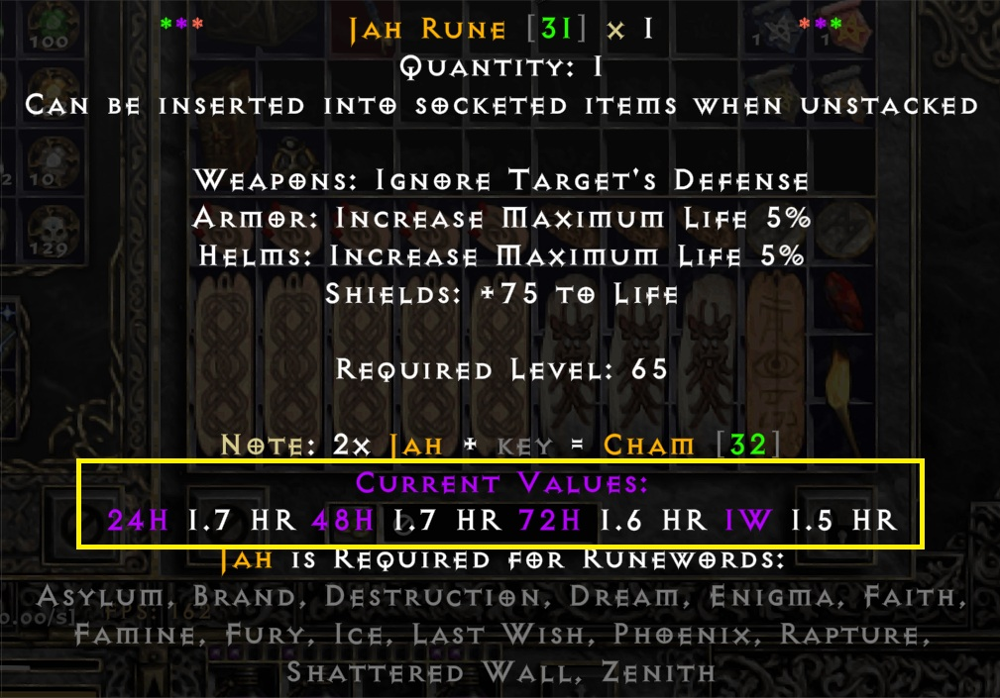](screenshots/RunePriceExample3.jpg) |
| [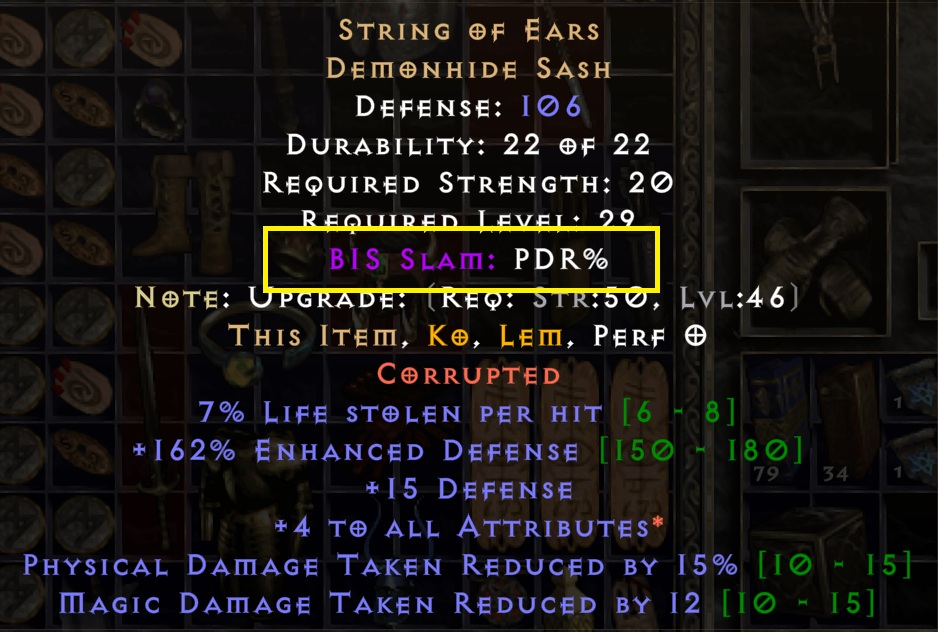](screenshots/BISSlamExample2.jpg) | [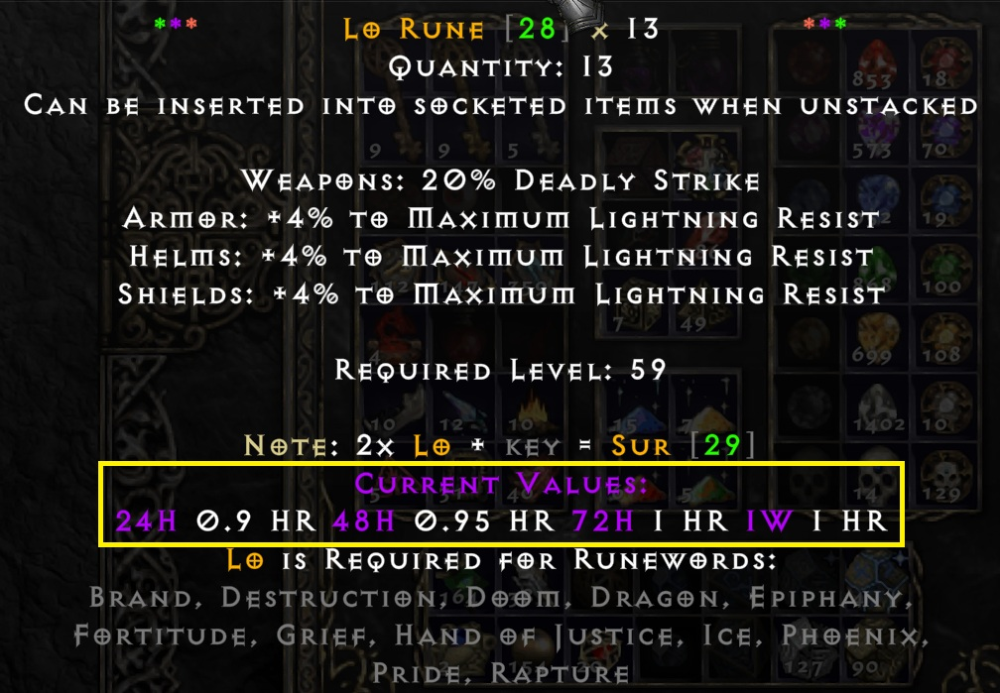](screenshots/RunePriceExample4.jpg) |

---

## 🧹 Item info & quality of life

- **Short sell values:** vendor prices show as `$35K` instead of long numbers.
- **Base notes:** white bases show their maximum sockets, which runewords fit, and cube upgrade recipes with the requirements after upgrading.
- **Runes and gems:** runes list the runewords that use them; gems show their cube recipes.
- **Charm tags:** grand, large and small charms are tagged by their useful stats (life, FHR, resistances, skills and more).
- **Crafting infusions** show what each craft gives.
- **Shop hunting:** vendor items worth buying are highlighted, from high-skill staffmods to Fire Golem items.

---

## 📸 Screenshots

### Filter Builder

**Colors & sounds:** color themes, drop sounds and every highlight style
[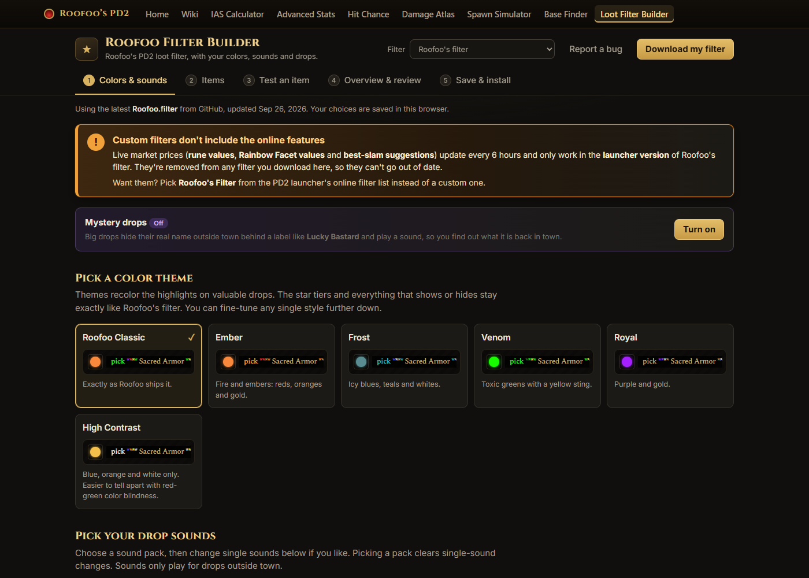](screenshots/BuilderColorsSounds.png)

**Items:** star tiers, show / hide per filter level and options, with an in-game style item card

**Test an item:** how one item looks on every filter level
[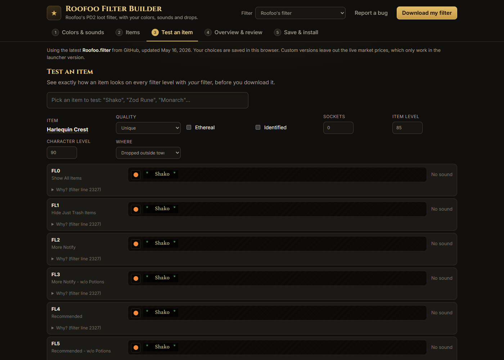](screenshots/BuilderTestItem.png)

**Overview & review:** everything hidden (red) and shown (green) on a filter level, by rarity, sockets and item level
[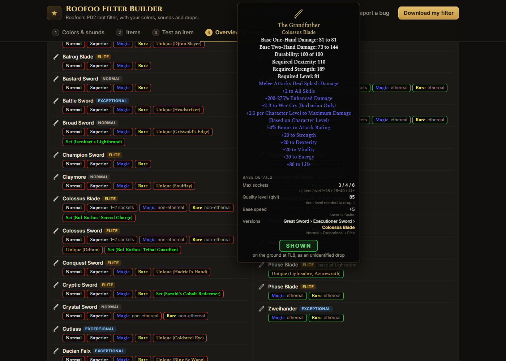](screenshots/BuilderOverview.png)

**Save & install:** download, install steps and the new-item safety net
[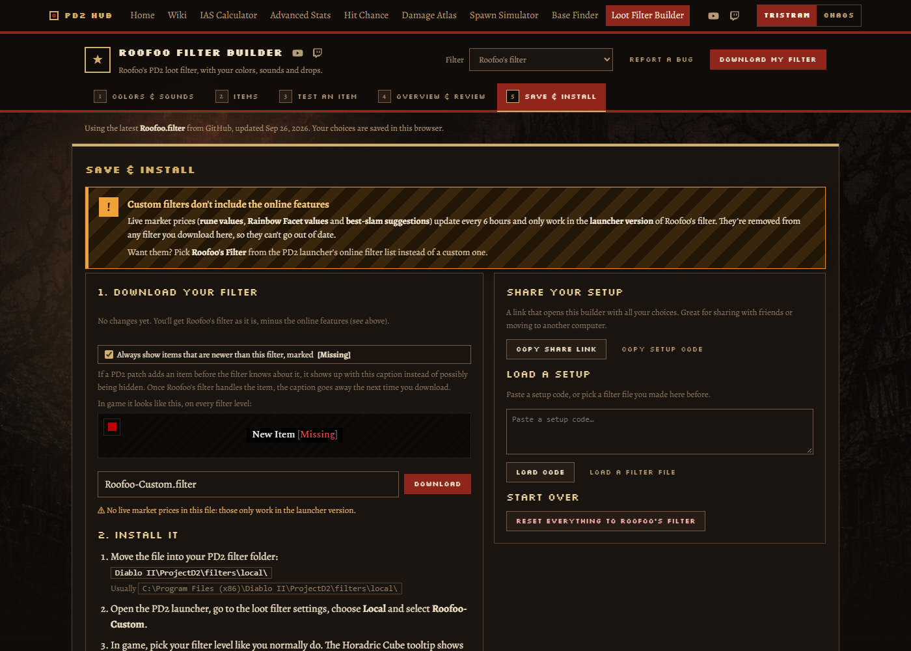](screenshots/BuilderSaveInstall.png)

### In game

**Charms & jewels**

**Drop notifications**

**Fire Golem shop highlight**
[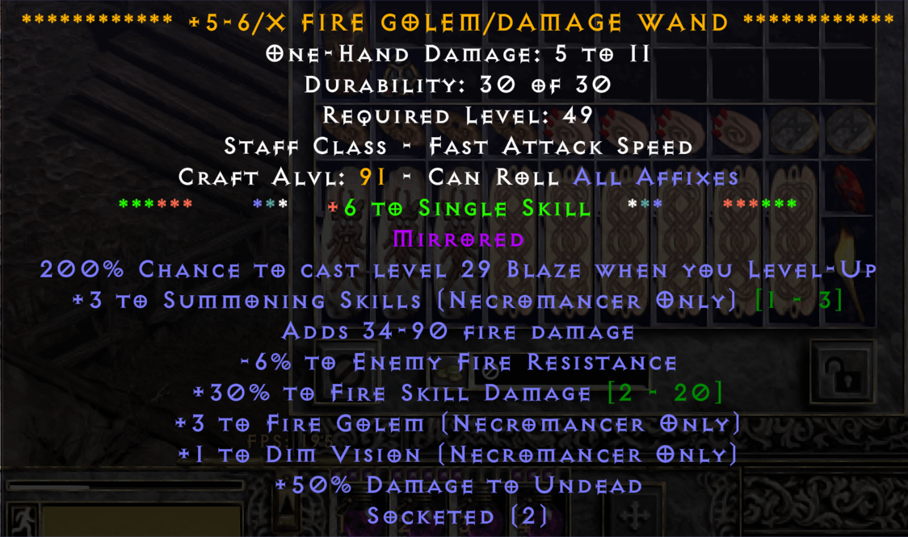](screenshots/FGShop.png)

**Enpherno's Bastard Sword meme drop**

