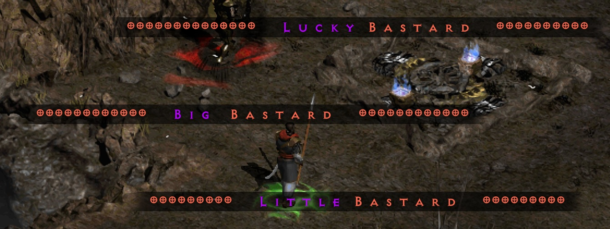

## 🩸 BASTARD MYSTERY DROPS

The RoofooBastardMystery filter fork includes a Bastard Mystery System for selected high-value drops.

When these items drop unidentified outside of town, the filter hides the real item name and replaces it with a mystery label + custom sound.
This keeps big drops exciting while still allowing the item to be safely identified once brought back to town.

### Mystery Labels

| Mystery Label | Applies To | Included Drops |
| --- | --- | --- |
| Little Bastard | Lower mystery drops | Larzuk's Puzzlebox, Vex Rune, Ohm Rune, Lo Rune, Skeleton Key, Demonic Cube |
| Lucky Bastard | Higher mystery drops | Sur Rune, Ber Rune, Jah Rune, Cham Rune, Zod Rune, Vial of Lightsong, Lilith's Mirror, Horadrim Navigator, Horadrim Almanac, Tyrael's Might / Templar's Might |
| HOLY MOLY | Boss-arena-only boss uniques | The Third Eye, Cage of the Unsullied, Band of Skulls, Aidan's Scar, Dark Abyss, Itherael's Path, Overlord's Helm, Hadriel's Hand |
| Big Bastard | 3-star uniques | Mang Song's Lesson, Griffon's Eye, Veil of Steel / Nightwing's Veil |
| Big Bastard | ETH 3-star uniques | Mang Song's Lesson, Doombringer, Executioner's Justice, The Grandfather, The Cranium Basher / Earth Shifter, Steel Pillar, Tomb Reaver, The Reaper's Toll, Stormspire, Schaefer's Hammer / Stone Crusher, Bloodtree Stump, Tyrael's Might / Templar's Might, Veil of Steel / Nightwing's Veil, Purgatory, Steel Carapace |

### 📝 Notes

- 🎯 Bastard Mystery drops only trigger outside town  
- 🏟️ Boss unique mystery drops only trigger inside boss arenas  
- 🔊 All mystery drops use a custom sound cue  
- 🏠 Returning to town reveals the item name normally  

#### Bastard Mystery Drop Examples

